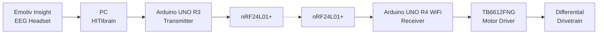

# EEG Robot

A real-time EEG-controlled mobile robotics platform, integrating brain-computer interfacing, embedded systems, wireless communications and motor control.

Originally built as my final-year BEng (Hons) Mechanical Engineering project, with the long-term aim of creating an alternatively-accessible wheelchair — this robotic platform used as the base. Development has continued independently since finishing the degree, progressing mostly into multimodal sending (see my: **[`multimodal-sensing repo`](https://github.com/alexandershaw03/multimodal-sensing)**).

> **Project status:** V1 completed and demonstrated. V2 currently in development.

**[V1 — Completed](https://github.com/alexandershaw03/eeg-robot/blob/main/V1)** · **[V1 Transmitter Code](https://github.com/alexandershaw03/eeg-robot/blob/main/V1/firmware/eeg_car_hiti_tx.ino)** · **[V1 Receiver Code](https://github.com/alexandershaw03/eeg-robot/blob/main/V1/firmware/eeg_car_rx.ino)** · **[V2 — Current Development](https://github.com/alexandershaw03/eeg-robot/blob/main/V2)**

| Version | Status | Description |
|---|---|---|
| **V1 — Undergraduate Project** | Complete | Original EEG-controlled mobile robot, built and demonstrated for my undergraduate project. |
| **V2 — Independent Improvement** | In development | Continuing on actuation, sensing, feedback, and software after graduation. |

V1 documents the completed academic project as demonstrated (excluding my thesis/deliverables); V2 is the engineering work since.

---

## V1 — Completed EEG-Controlled Robot

V1 converts trained mental commands, detected via an **Emotiv Insight EEG headset**, into wireless movement command/s for my robot. Three trained mental commands — **Push, Pull, Drop** — map to forward, left and right motion.

[](/alexandershaw03/eeg-robot/blob/main/media/v1/eeg-robot-v1-hero.jpg)

### System Architecture



Built as a full mechatronic control-chain, not just an EEG-classification demo.

---

## Embedded Control System

The transmitter (TX) and receiver (RX) share a lightweight control packet:

```
struct ControlPacket {
    uint8_t command;
    uint8_t isValid;
    uint8_t sequenceNumber;
};
```

Packets transmit continuously at **20 Hz**, so the receiver can tell active connection, from a dropped one; deleting backdated packets too. The receiver handles:

- sequence-number tracking and duplicate-packet rejection
- communication timeout detection with automatic fail-safe stop
- staged RF recovery, escalating to a full radio restart
- soft-start motor ramping and differential steering
- link status shown live on the UNO R4's LED matrix

A loss of valid packets zeroes the motor speed, rather than letting the robot keep executing the last command. This makes the default failure mode "stop," - not "keep going blind" ... unironically, a feature quite useful for intended wheelchair applications.

Full firmware details in [`V1/README.md`](https://github.com/alexandershaw03/eeg-robot/blob/main/V1/README.md).

---

## V1 Hardware

**Neural interface:** Emotiv Insight EEG-headset, HITIbrain (EEG-to-Arduino interface)
**Embedded control:** Arduino UNO R3 (TX), Arduino UNO R4 WiFi (RX), 2× nRF24L01+ RF modules
**Actuation:** TB6612FNG dual motor driver, DC differential drivetrain
**Mechanical/electrical:** custom chassis, wiring and power electronics, custom mounting hardware

---

## V1 Motion Control

| Command | Behaviour |
|---|---|
| `STOP` | Both motors stopped |
| `FORWARD` | Both sides driven forward |
| `LEFT` | Differential forward-left steering |
| `RIGHT` | Differential forward-right steering |

Forward motion was the most consistent in testing. Left/right steering worked, just less reliably. I covered this extensively in my thesis, but it boiled down to limitations of the original drivetrain, and mental-command reliability — one of the things V2 is addressing.

---

## Fail-Safe Behaviour

As EEG-derived commands end up controlling physical hardware (over a wireless link), I treated communication failure as an explicit state rather, than an edge case:

```
Valid packets received
        │
        ▼
   Normal control
        │
        │ ... if no valid packet for 200 ms
        ▼
   FAIL-SAFE STOP
        │
        ▼
 Signal-loss state
        │
        ├── periodic light RF recovery
        │
        └── prolonged failure → full RF restart
```

This stops a dropped connection from leaving the drivetrain running on a stale command indefinitely.

---

## V2 — Independent Development

A continuation of the completed V1 robot, rather than replacing it. Current focus: drivetrain controllability, motor feedback/closed-loop control, embedded telemetry, and host-side monitoring — the gaps that showed up during V1 testing.

Documented separately under [`V2/`](https://github.com/alexandershaw03/eeg-robot/blob/main/V2) as pieces land.

---

## Repository Structure

```
eeg-robot/
│
├── README.md
├── LICENSE
│
├── V1/
│   ├── README.md
│   ├── firmware/
│   │   ├── transmitter/
│   │   └── receiver/
│   ├── hitibrain/
│   ├── hardware/
│   └── docs/
│
├── V2/
│   ├── README.md
│   ├── firmware/
│   ├── software/
│   ├── hardware/
│   └── docs/
│
└── media/
    ├── v1/
    └── v2/
```

---

## Related Work

V1's completion led into a separate project — raw EEG acquisition, multimodal EEG/vision recording over LSL/XDF, and Jetson-based edge perception: [`multimodal-sensing`](https://github.com/alexandershaw03/multimodal-sensing). Kept as its own repo, so this one stays focused on the physical robot itself.

---

**BEng (Hons) Mechanical Engineering — Final-Year Project, London South Bank University, 2025–2026**
