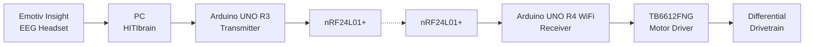

# EEG Robot

A real-time EEG-controlled mobile robotics platform integrating brain-computer interfacing, embedded systems, wireless communications and motor control.

The system was originally developed as my final-year project for a BEng (Hons) in Mechanical Engineering, with the aim of making an alternatively-accesible wheelchair (where the "robotic platform" would become the basis of this). Following completion of the degree project, development has continued independently as a broader robotics and sensing platform.

The original objective was to demonstrate an end-to-end system capable of converting trained EEG-derived mental commands into reliable physical movement, again, with longer-term motivation of exploring alternative control interfaces for accessible mobility.

> **Project status:** V1 completed and demonstrated. V2 currently in development.

---

## Project Versions

| Version                          | Status         | Description                                                                                                                                            |
| -------------------------------- | -------------- | ------------------------------------------------------------------------------------------------------------------------------------------------------ |
| **V1 — Final-Year Project**      | Complete       | Original EEG-controlled mobile robot developed and demonstrated as part of my undergraduate engineering project.                                       |
| **V2 — Independent Development** | In development | Continued development of the platform following graduation, focused on improving actuation, sensing, feedback, software and overall system capability. |

The separation between V1 and V2 is intentional: V1 documents the completed academic project as it was demonstrated, while V2 records the engineering work undertaken independently afterwards.

---

## V1 - Completed EEG-Controlled Robot

V1 converts trained mental commands detected using an **Emotiv Insight EEG headset** into wireless motion commands for a mobile robot.

Three trained mental commands — **Push, Pull and Drop** - were used to generate forward, left and right motion commands.

### System Architecture




The system was designed as a complete mechatronic control chain rather than a standalone EEG-processing demonstration.

---

## Embedded Control System

The transmitter and receiver use a custom lightweight control packet containing:

```cpp
struct ControlPacket {
    uint8_t command;
    uint8_t isValid;
    uint8_t sequenceNumber;
};
```

Control packets are transmitted continuously at **20 Hz**, allowing the receiver to distinguish between an actively maintained connection and communication loss.

The receiver implements several layers of communication and actuator protection, including:

* packet validity checking
* sequence-number tracking
* duplicate-packet rejection
* newest-packet prioritisation
* communication timeout detection
* automatic fail-safe stopping
* staged RF recovery
* full radio restart behaviour
* soft-start motor ramping
* differential steering control
* visual link-status indication using the UNO R4 LED matrix

A loss of valid control packets causes the requested motor speed to return automatically to zero rather than leaving the robot executing its previous command.

Detailed firmware architecture and timings are documented in [`V1/README.md`](V1/README.md).

---

## V1 Hardware

### Neural Interface

* Emotiv Insight EEG headset
* HITIbrain EEG/Arduino interface

### Embedded Control

* Arduino UNO R3 - transmitter
* Arduino UNO R4 WiFi - receiver
* 2 × nRF24L01+ 2.4 GHz RF modules

### Actuation

* TB6612FNG dual motor driver
* DC motor differential drivetrain

### Mechanical / Electrical

* custom mobile chassis
* integrated wiring and power electronics
* custom-designed electronic hardware and mounting components

---

## V1 Motion Control

The robot supports four embedded motion states:

| Command   | Behaviour                            |
| --------- | ------------------------------------ |
| `STOP`    | Both motors stopped                  |
| `FORWARD` | Both drivetrain sides driven forward |
| `LEFT`    | Differential forward-left steering   |
| `RIGHT`   | Differential forward-right steering  |

Forward motion proved the most consistent during physical testing.

Left and right steering were successfully implemented using differential motor speeds, although their physical performance was less consistent than straight-line motion due to limitations of the original drivetrain.

These limitations are among the areas being addressed through continued V2 development.

---

## Reliability and Fail-Safe Behaviour

Because EEG-derived commands ultimately control physical hardware over a wireless link, communication failure was treated as an explicit system state.

The V1 receiver therefore implements a layered recovery strategy:

```text
Valid packets received
        │
        ▼
   Normal control
        │
        │ no valid packet for 200 ms
        ▼
   FAIL-SAFE STOP
        │
        ▼
 Signal-loss state
        │
        ├── periodic light RF recovery
        │
        └── prolonged failure
                │
                ▼
          Full RF restart
```

This prevents communication loss from leaving the drivetrain operating indefinitely using a stale command.

---

## V2 - Independent Development

V2 represents the continuation of the project after completion of the original degree requirements.

Rather than replacing V1, it uses the completed robot as a starting point for further engineering development.

Current work is focused on improving areas identified during V1 development and testing, including:

* drivetrain performance and controllability
* motor feedback and closed-loop control
* embedded telemetry
* host-side monitoring and control software
* system observability and diagnostics
* sensing integration
* EEG acquisition and processing
* overall hardware and software modularity

V2 development will be documented separately under [`V2/`](V2/) as individual subsystems are implemented and validated.

---

## Repository Structure

```text
eeg-robot/
│
├── README.md
│
├── LICENSE
│
├── V1/
│   ├── README.md
│   ├── firmware/
│   │   ├── transmitter/
│   │   └── receiver/
│   ├── hitibrain/
│   ├── hardware/
│   └── docs/
│
├── V2/
│   ├── README.md
│   ├── firmware/
│   ├── software/
│   ├── hardware/
│   └── docs/
│
└── media/
    ├── v1/
    └── v2/
```

---

## Related Development

The completion of V1 led directly into further work involving:

* raw EEG acquisition and analysis
* multimodal EEG and event recording
* Lab Streaming Layer (LSL)
* XDF recording and analysis
* MNE-based EEG processing
* computer-vision-derived human kinematics
* NVIDIA Jetson edge perception
* synchronised EEG, experiment and vision streams

That work is maintained separately from the original robot so that this repository can clearly document the evolution of the physical EEG-controlled platform.

---

## Project Context

**BEng (Hons) Mechanical Engineering — Final-Year Project**

London South Bank University
2025–2026

The original system was designed, manufactured, programmed, integrated and experimentally demonstrated as an end-to-end EEG-controlled robotic platform.

Development is continuing independently beyond the original academic project.
