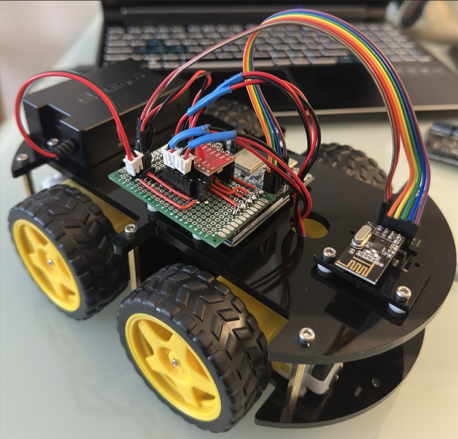
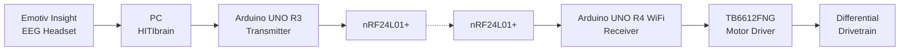

# EEG Robot V1

**Completed BEng Final-Year Project - 2026**

V1 is the original completed and demonstrated version of the EEG-controlled mobile robot.

It combines an Emotiv Insight EEG headset, HITIbrain command interface, Arduino-based embedded control system, nRF24L01+ wireless link and TB6612FNG motor controller to translate trained mental commands into physical robot movement.

This directory preserves the system as developed for the final-year project. Later modifications and post-graduation development are documented separately under [`V2/`](../V2/).
<p align="center">
  
</p>


## System Overview



The system separates EEG command generation from the mobile platform itself. The PC and transmitter generate the requested control state, while the receiver is responsible for deciding whether that command is sufficiently recent and valid to be executed.

---

## EEG Control

EEG control was provided using an **Emotiv Insight** headset and the **HITIbrain** environment.

Three trained mental commands were used:

* **Push**
* **Pull**
* **Drop**

These were linked through HITIbrain to three Arduino digital control signals representing:

* forward
* left
* right

If no valid movement command is active, the transmitter generates a stop command.

The transmitter also rejects ambiguous states. If more than one movement input is simultaneously active, the selected command falls back to `STOP` rather than choosing an arbitrary movement.

---

## Transmitter

### Hardware

* Arduino UNO R3
* nRF24L01+
* PC running HITIbrain

### HITI Inputs

```cpp
const int hitiForwardPin = 2;
const int hitiLeftPin    = 3;
const int hitiRightPin   = 4;
```

The transmitter continuously reads the three HITI control inputs and converts them into one of four command states:

```cpp
CMD_STOP    = 0
CMD_FORWARD = 1
CMD_LEFT    = 2
CMD_RIGHT   = 3
```

---

## Wireless Protocol

Communication between the two embedded nodes uses nRF24L01+ 2.4 GHz transceivers.

Both nodes use the same RF configuration:

| Parameter            | Setting    |
| -------------------- | ---------- |
| Address              | `00001`    |
| RF channel           | `76`       |
| Data rate            | `250 kbps` |
| Auto acknowledgement | Enabled    |
| PA level             | Low        |
| Command interval     | `50 ms`    |

A command packet is therefore transmitted every **50 ms**, corresponding to a nominal control update rate of **20 Hz**.

### Packet Format

```cpp
struct ControlPacket {
    uint8_t command;
    uint8_t isValid;
    uint8_t sequenceNumber;
};
```

The packet is only three bytes long.

`command` specifies the requested movement state.

`isValid` contains a predefined validity marker.

`sequenceNumber` increments after every transmission and automatically wraps after 255.

This allows the receiver to detect repeated packets and distinguish new commands from stale data.

---

## Receiver

### Hardware

* Arduino UNO R4 WiFi
* nRF24L01+
* TB6612FNG dual motor driver
* integrated UNO R4 12 × 8 LED matrix

The receiver continuously monitors the RF link while independently updating the motor-speed ramp and visual connection indicator.

---

## Packet Handling

If multiple RF packets have accumulated in the receive buffer, the firmware deliberately drains the buffer and processes only the newest packet.

```text
RF buffer
   │
   ├── older packet
   ├── older packet
   └── newest packet  ──► process
```

This prevents the physical robot from working through a backlog of commands which may no longer represent the user's current intent.

Before a command is executed, the receiver checks that:

1. the validity marker is correct;
2. the command ID is recognised; and
3. its sequence number differs from the most recently processed packet.

Invalid or duplicate packets are ignored.

---

## Motion Control

The drivetrain is controlled using differential motor speeds.

### Forward

```text
Left motor  → high speed
Right motor → high speed
```

### Left

```text
Left motor  → low speed
Right motor → medium speed
```

### Right

```text
Left motor  → medium speed
Right motor → low speed
```

The V1 firmware uses:

```cpp
speedHi  = 180;
speedMed = 100;
speedLo  = 10;
```

on the Arduino PWM range.

The steering commands therefore continue moving forward while generating a speed difference between the two drivetrain sides.

Straight-line forward movement was the most reliable physical behaviour of the completed prototype. Left and right control were functional but less mechanically consistent because of the characteristics of the original drivetrain.

---

## Soft-Start Control

Motor commands are not applied as instantaneous PWM changes.

Instead, each side of the drivetrain maintains a current speed and target speed.

```text
Current PWM
    │
    │ ramp toward target
    ▼
Target PWM
```

The V1 configuration updates the requested output every:

```text
30 ms
```

using a PWM increment of:

```text
1
```

This progressively ramps the motor output towards the target rather than immediately applying the full requested PWM value.

The same mechanism also ramps the output back towards zero when stopping.

---

## Communication Fail-Safe

The receiver does not assume that silence means the previous command should continue.

A valid packet must continue to arrive for motion to remain authorised.

### Timeout

```text
200 ms without a new valid packet
                │
                ▼
          Signal lost
                │
                ▼
         Target PWM = 0
```

Since the transmitter normally sends every 50 ms, the receiver typically expects several command packets within the timeout period.

Loss of the RF connection therefore causes the drivetrain to transition towards a stopped state automatically.

---

## RF Recovery Strategy

V1 implements two levels of automatic radio recovery.

### Light Recovery

While the signal is lost, the receiver periodically resets its listening state.

```text
Every 500 ms
     │
     ▼
stopListening()
     │
     ▼
startListening()
```

This is intended to recover from a temporary receiver-state problem without completely restarting the radio.

### Full Radio Restart

If communication remains unavailable for more than:

```text
2.5 seconds
```

the receiver escalates to a full nRF24L01+ restart.

```text
powerDown()
    │
   20 ms
    │
powerUp()
    │
   20 ms
    │
startListening()
```

A five-second restart cooldown prevents repeated power cycling.

---

## Connection-State Indication

The Arduino UNO R4's integrated 12 × 8 LED matrix is used as a simple embedded status display.

When the signal is lost, the matrix flashes between fully illuminated and blank states.

When the communication link is active, a three-pixel animation moves around the outside edge of the matrix.

This provides immediate visual confirmation of the receiver's communication state without requiring a serial monitor.

---

## Motor Driver Connections

The receiver firmware uses the following TB6612FNG connections:

| Function | UNO R4 Pin |
| -------- | ---------: |
| `PWMA`   |          3 |
| `AIN2`   |          4 |
| `AIN1`   |          5 |
| `PWMB`   |          6 |
| `BIN1`   |          7 |
| `BIN2`   |          2 |

The nRF24L01+ interface uses:

| Function |          Pin |
| -------- | -----------: |
| CE       |            9 |
| CSN      |            8 |
| SPI      | Hardware SPI |

---

## Repository Contents

```text
V1/
│
├── README.md
│
├── firmware/
│   ├── transmitter/
│   │   └── HITI_EEG_CAR_v1.ino
│   │
│   └── receiver/
│       └── eeg_car_receiver_v1.ino
│
├── hitibrain/
│   └── HITI_EEG_CAR.hib
│
├── hardware/
│
└── docs/
```

---

## Demonstrated Behaviour

The completed V1 prototype demonstrated the full control chain from trained EEG mental command to physical robot actuation.

The strongest and most repeatable behaviour was forward movement.

EEG-triggered left and right steering were also successfully demonstrated, although their physical consistency was limited by the mechanical drivetrain rather than the absence of steering logic in the control system.

The resulting prototype therefore established the complete EEG-to-actuation architecture while also identifying clear areas for further mechanical, embedded and control-system development.

Those improvements form the basis of **V2**.

---

## V1 Status

**Complete / archived as demonstrated.**

V1 is intentionally retained as the completed undergraduate implementation.

Future changes to the robot are documented under V2 rather than silently modifying the original system, allowing the development history and engineering progression of the platform to remain visible.
